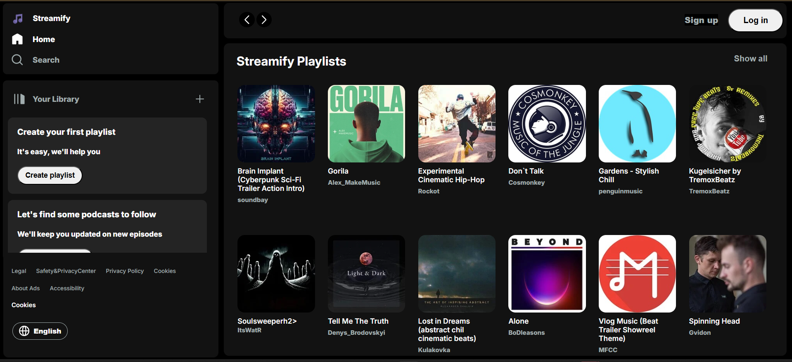
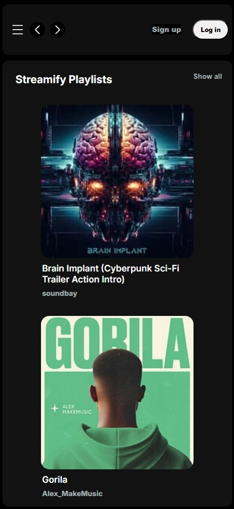

# 🎧 Streamify – Music Streaming App

A responsive front-end inspired by the Spotify homepage built using **HTML**, **CSS**, and **JavaScript**. This project demonstrates my ability to recreate real-world user interfaces with clean layout, interactive elements, and mobile responsiveness.

---

## 🔗 Live Demo

👉 [View Project Live](https://streamify-clone-black-eight.vercel.app/)

---

## 🔥 Features

- 🎵 Working playbar UI
- 📱 Fully responsive design (mobile, tablet, desktop)
- ✨ Smooth transitions and hover effects
- 🧠 Built using pure HTML, CSS, and JavaScript

---

## 📸 Screenshots

### 💻 Desktop View



### 📱 Mobile View



---

## 🚀 How to Run Locally

1. Clone the repository:
   ```bash
   git clone https://github.com/sarwesh2002/streamify-ui.git
